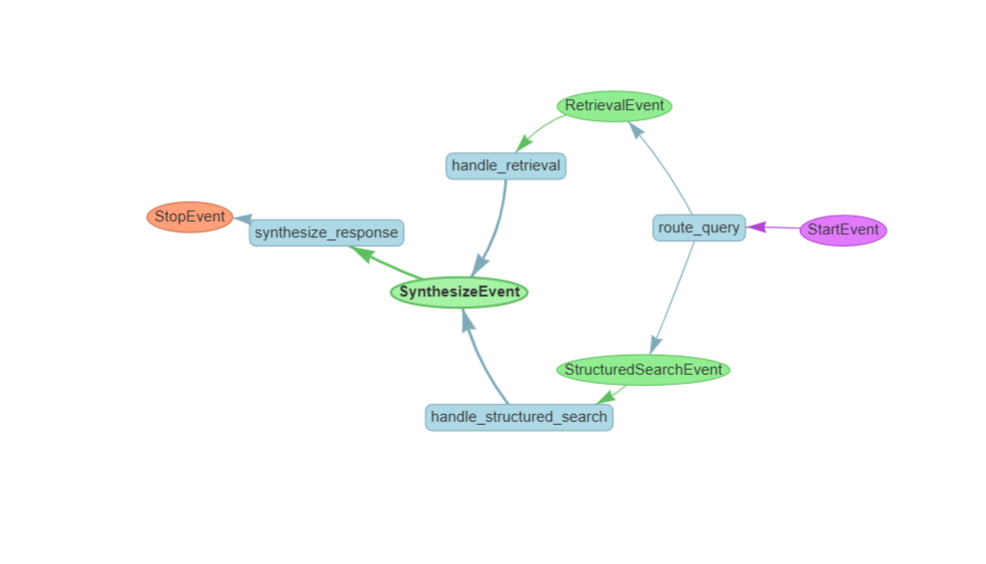

# Smart AI Agent: Hybrid RAG & Structured Workflow 🤖

פרויקט זה מציג סוכן בינה מלאכותית (AI Agent) מתקדם שנבנה באמצעות **LlamaIndex Workflows**. הסוכן משלב חיפוש סמנטי ממסמכים (RAG) יחד עם שליפת נתונים מובנית מקבצי JSON, תוך שימוש בניתוב חכם (Routing) המבוסס על כוונת המשתמש.

## 🎯 מטרת הפרויקט
בניית עוזר חכם שמסוגל לענות על שאלות טכניות מורכבות מצד אחד (מתוך מאגר ידע סמנטי), ולספק תשובות מדויקות על חוקים והחלטות עסקיות מצד שני (מתוך מקור נתונים מובנה).

## 🧠 ארכיטקטורת ה-Workflow
הסוכן מנהל את זרימת המידע בצורה מבוזרת (Event-Driven):
- **StartEvent**: קבלת שאילתה מהמשתמש.
- **Router Step**: ניתוח השאילתה בעזרת Cohere LLM ובחירה בנתיב המתאים.
- **Search Steps**: חיפוש ב-Pinecone (Semantic) או שליפה מ-JSON (Structured).
- **Synthesize Step**: בניית תשובה סופית מקצועית המבוססת על ההקשר שנמצא.

### 📊 תרשים זרימה


## ❓ דוגמאות לשאלות שהאגנט יודע לענות
- **שאלת RAG סמנטית:** "איך ה-React SPA משתמש ב-Vite ומה היתרונות שלו?"
- **שאלת JSON מובנית:** "אילו חוקים (rules) הוגדרו במערכת לניהול משימות?"
- **שאלה על אזהרות:** "האם יש אזהרות קריטיות לגבי הסטטוס של המשימות?"

## 🛠️ טכנולוגיות
- **Framework:** LlamaIndex Workflows
- **LLM:** Cohere (Command-R)
- **Vector DB:** Pinecone
- **UI:** Gradio
- **Language:** Python

## 🚀 איך להריץ את הפרויקט

### 1. שיכפול הריפוזיטורי
פתחו טרמינל והריצו:

```bash
git clone https://github.com/miri74804
cd RAGPROJECT
```

### 2. התקנת הספריות הנדרשות
הריצו את הפקודה הבאה כדי להתקין את כל התשתיות:

```bash
pip install llama-index llama-index-llms-cohere llama-index-embeddings-cohere pinecone-client gradio python-dotenv
```

### 3. הגדרת מפתחות API
צרו קובץ בשם `.env` בתוך תיקיית `Project`.

הוסיפו לקובץ את המפתחות שלכם בצורה הבאה:

```
COHERE_API_KEY=your_key_here
PINECONE_API_KEY=your_key_here
```

### 4. הרצת הסוכן
פתחו את התיקייה `Project` בתוך ה-VS Code.

פתחו את קובץ המחברת: `Smart_AI_Agent_Workflow.ipynb`.

לחצו על **Run All (הפעל הכל)**. הממשק של **Gradio** יפתח ותוכלו להתחיל לשאול שאלות!

---

👩‍💻 Developed By  
מרים כ.

📩 ליצירת קשר:  
miri74804@gmail.com